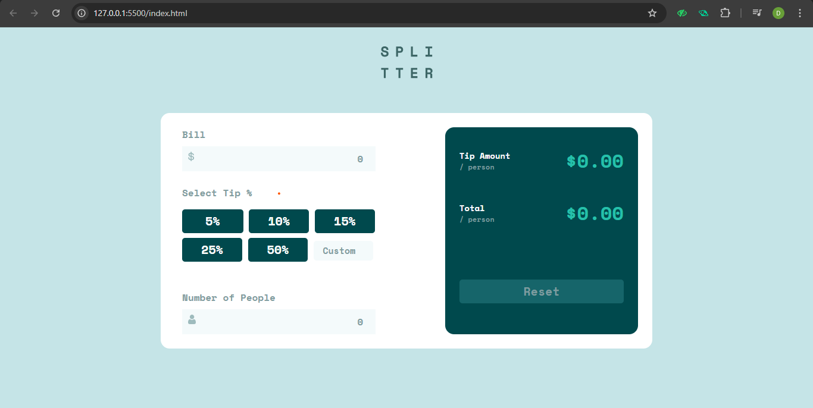

# Frontend Mentor - Tip Calculator App

## 🚀 Overview

This is my solution to the [Tip Calculator App challenge on Frontend Mentor](https://www.frontendmentor.io/challenges/tip-calculator-app-ugJNGbJUX). The app allows users to easily calculate the tip and total amount per person for a bill, with a clean, responsive design and interactive features.

## ✨ Features

- Responsive layout for mobile and desktop screens
- Interactive tip percentage selection (preset buttons and custom input)
- Real-time calculation of tip and total per person
- Input validation and error handling
- Modern UI with hover states and accessibility considerations

## 📸 Screenshot

## 🔗 Links

- [Live Site](https://your-live-site-url.com)
- [Frontend Mentor Challenge](https://www.frontendmentor.io/challenges/tip-calculator-app-ugJNGbJUX)

## 🛠️ Built With

- Semantic HTML5
- CSS (custom properties, Flexbox, Grid)
- JavaScript (DOM manipulation, event handling)
- [Space Mono](https://fonts.google.com/specimen/Space+Mono) font
- [Bootstrap 5](https://getbootstrap.com/) for layout

## 📖 How to Use

1. Enter the bill amount.
2. Select a tip percentage or enter a custom value.
3. Enter the number of people splitting the bill.
4. View the calculated tip and total per person.
5. Use the reset button to clear all fields.

## 💡 What I Learned

- Building responsive layouts with Flexbox and Grid
- Managing state and user input in vanilla JavaScript
- Implementing accessible and user-friendly form validation
- Styling interactive elements with custom CSS and Bootstrap

## 🏗️ Continued Development

- Improve accessibility for keyboard navigation
- Add unit tests for calculation logic
- Enhance mobile experience and animations

## 📚 Useful Resources

- [Frontend Mentor Community](https://www.frontendmentor.io/community)
- [MDN Web Docs - JavaScript](https://developer.mozilla.org/en-US/docs/Web/JavaScript)
- [CSS Tricks - Flexbox Guide](https://css-tricks.com/snippets/css/a-guide-to-flexbox/)

## 👤 Author

- Dawood Ahmed  
- GitHub: [@dawood125](https://github.com/dawood125)  
- Frontend Mentor: [@dawood125](https://www.frontendmentor.io/profile/dawood125)  

## 🙏 Acknowledgments

Thanks to [Frontend Mentor](https://www.frontendmentor.io/) for the challenge and everyone in the community for feedback and support!

